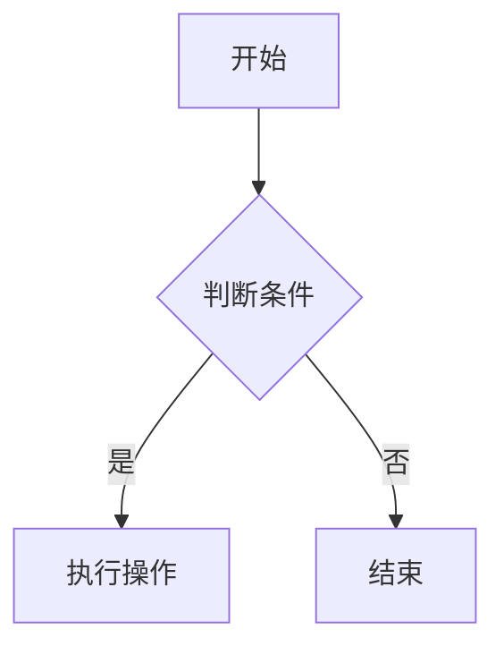
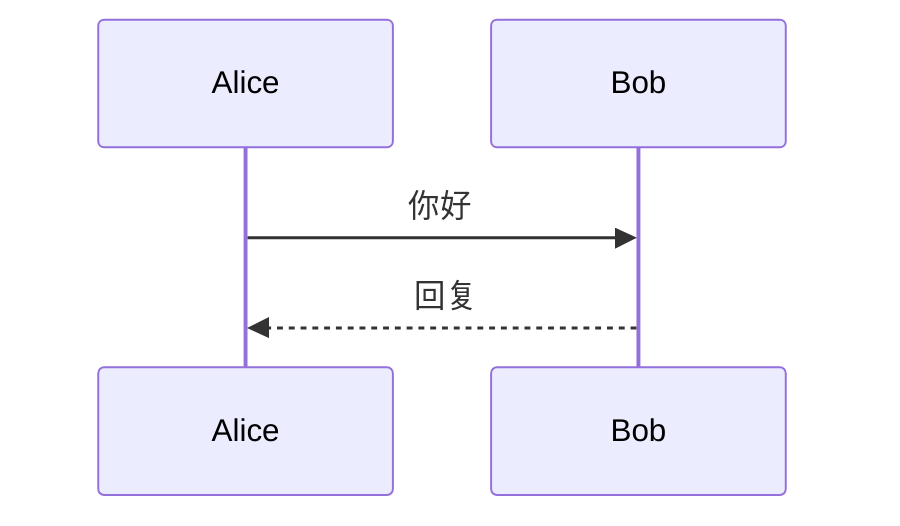
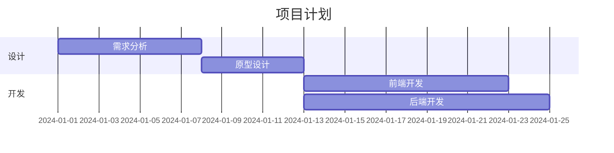

# Mermaid vs AntV Infographic 对比分析

## 概述

| 维度 | Mermaid | AntV Infographic |
|------|---------|------------------|
| **定位** | 文本到图表的转换工具 | AI 驱动的信息图表生成引擎 |
| **核心目标** | 让文档随代码更新，解决"文档腐烂"问题 | 用 AI 赋能数据叙事，简化信息展示 |
| **主要用户** | 开发者、技术文档编写者 | 产品经理、数据分析师、内容创作者 |
| **学习曲线** | 中等（类 Markdown 语法） | 低（自然语言 + AI 生成） |
| **开源协议** | MIT | MIT |

## 核心功能对比

### 1. 图表类型

#### Mermaid 支持的图表类型（20+ 种）

| 类别 | 图表类型 |
|------|---------|
| **流程图** | Flowchart（流程图） |
| **时序图** | Sequence Diagram（时序图） |
| **类图** | Class Diagram（类图） |
| **状态图** | State Diagram（状态图） |
| **关系图** | Entity Relationship Diagram（实体关系图） |
| **甘特图** | Gantt（甘特图） |
| **用户旅程** | User Journey（用户旅程图） |
| **饼图** | Pie Chart（饼图） |
| **象限图** | Quadrant Chart（象限图） |
| **XY 图表** | XY Chart（XY 图表） |
| **桑基图** | Sankey（桑基图） |
| **时间线** | Timeline（时间线） |
| **思维导图** | Mindmap（思维导图） |
| **Git 图** | GitGraph（Git 提交图） |
| **需求图** | Requirement Diagram（需求图） |
| **C4 模型** | C4 Diagram（C4 模型图） |
| **方块图** | Block Diagram（方块图） |
| **架构图** | Architecture（架构图） |
| **雷达图** | Radar（雷达图） |
| **树图** | Treemap（树图） |
| **数据包** | Packet（数据包图） |
| **看板** | Kanban（看板） |

#### AntV Infographic 支持的模板类型（7 大类，219+ 个模板）

| 类别 | 说明 |
|------|------|
| **Chart** | 柱状图、折线图、饼图、词云等 |
| **Comparison** | 二元对比、SWOT 分析、层次对比等 |
| **Hierarchy** | 思维导图、组织结构图、层次树等 |
| **List** | 列表、网格、金字塔、蛇形布局等 |
| **Quadrant** | 象限分析、四象限图等 |
| **Relation** | 关系图、环形关系图等 |
| **Sequence** | 时间线、流程图、阶梯图、路线图等 |

**对比分析：**
- Mermaid 偏向**技术文档和软件设计**，提供 UML 类图、时序图等专业图表
- Infographic 偏向**商业展示和数据叙事**，提供丰富的预设模板和主题

### 2. 语法风格

#### Mermaid 语法示例







#### AntV Infographic 语法示例

```plain
infographic list-row-horizontal-icon-arrow
data
  title 互联网技术发展
  desc 从 Web 1.0 到 AI 时代的关键里程碑
  items
    - time 1991
      label Web 1.0
      desc Tim Berners-Lee 发布第一个网站
      icon mdi/web
    - time 2004
      label Web 2.0
      desc 社交媒体成为主流
      icon mdi/account-multiple
theme
  palette #3b82f6 #8b5cf6 #f97316
```

**对比分析：**
- Mermaid 使用**类 Markdown 语法**，以声明式方式描述图表结构
- Infographic 使用**结构化语法**，强调数据项（items）和主题配置
- Mermaid 语法更简洁，Infographic 语法更声明式

### 3. AI 集成能力

#### Mermaid AI 集成

- **Mermaid AI（实验性）**：支持自然语言生成图表
- **Mermaid Chart MCP Server**：支持 Claude 等 AI 助手调用
- **在线编辑器 AI 功能**：支持 AI 辅助生成

#### AntV Infographic AI 集成

| 集成方式 | 说明 |
|---------|------|
| **AI Infographic 在线工具** | 自然语言输入 → 自动生成图表 |
| **Claude Code 技能** | 5 个技能模块：creator、syntax、structure、item、template |
| **Codex 集成** | OpenAI 代码助手技能 |
| **流式渲染** | 实时渲染 AI 流式输出 |
| **自定义 AI 提示词** | 提供完整的系统角色和输出格式模板 |

**对比分析：**
- Infographic **专为 AI 设计**，语法和功能都针对 AI 生成优化
- Mermaid AI 能力是**后期添加**的实验性功能
- Infographic 提供更完整的 AI Agent 技能生态

### 4. 主题与样式

#### Mermaid 主题配置

```js
mermaid.initialize({
  theme: 'base',
  themeVariables: {
    primaryColor: '#3b82f6',
    edgeLabelBackground: '#ffffff',
    tertiaryColor: '#f3f4f6'
  }
});
```

内置主题：default、base、dark、neutral

#### AntV Infographic 主题系统

| 功能 | 说明 |
|------|------|
| **预设主题** | 手绘、渐变、图案等多种预设 |
| **自定义主题** | 配置颜色、字体、图案等视觉元素 |
| **自定义色板** | 定义品牌配色方案 |
| **自定义字体** | 指定使用的字体资源 |
| **自定义图案** | 设计背景和装饰图案 |

**对比分析：**
- Mermaid 主题系统**简洁**，主要通过配置变量调整
- Infographic 主题系统**丰富**，支持深度定制品牌视觉
- Infographic 预设主题**更美观**，开箱即用效果更好

### 5. 编辑与导出

| 特性 | Mermaid | AntV Infographic |
|------|---------|------------------|
| **在线编辑器** | Mermaid Live Editor | Live Editor |
| **实时预览** | ✅ | ✅ |
| **导出 PNG** | ✅ | ✅ |
| **导出 SVG** | ✅ | ✅ |
| **导出其他格式** | Markdown、HTML | PNG、SVG |
| **分享链接** | ✅ | ✅ |
| **无代码操作** | ⚠️ 有限 | ✅ 完整 |
| **内置编辑器** | ⚠️ 基础 | ✅ 强大（可编辑主题、模板） |

### 6. 技术集成

#### Mermaid 集成方式

| 方式 | 命令/代码 |
|------|----------|
| **NPM** | `npm i mermaid` |
| **CDN** | `https://cdn.jsdelivr.net/npm/mermaid@11/dist/` |
| **CLI** | `mmdc -i input.mmd -o output.png` |
| **Python** | `pip install mermaid` |
| **集成平台** | GitHub、GitLab、Notion、Obsidian、VS Code 等 |

#### AntV Infographic 集成方式

| 方式 | 命令/代码 |
|------|----------|
| **NPM** | `npm install @antv/infographic` |
| **CDN** | `https://unpkg.com/@antv/infographic@latest/dist/` |
| **React** | useEffect + ref |
| **Vue 3** | onMounted + onBeforeUnmount |
| **JSX** | 声明式语法 |
| **AI Agent** | Claude Code、Codex 技能 |

**对比分析：**
- Mermaid **生态更成熟**，有大量第三方集成（Notion、Obsidian 等）
- Infographic **AI 集成更深**，提供 Claude Code 技能
- 两者都支持主流前端框架

## 使用场景对比

### Mermaid 最佳场景

| 场景 | 说明 |
|------|------|
| **技术文档** | API 文档、架构文档、设计文档 |
| **代码注释** | 在代码中嵌入流程图、时序图 |
| **版本控制** | 图表作为代码一起版本管理 |
| **项目管理** | 甘特图、里程碑规划 |
| **数据库设计** | ER 图、类图设计 |
| **团队协作** | 技术团队沟通标准工具 |

### AntV Infographic 最佳场景

| 场景 | 说明 |
|------|------|
| **商业演示** | 产品发布、季度总结、投资报告 |
| **数据叙事** | 数据分析报告、市场研究报告 |
| **营销内容** | 社交媒体图表、信息图设计 |
| **AI 应用** | AI Agent 数据可视化 |
| **品牌展示** | 需要统一视觉风格的企业内容 |
| **快速原型** | 快速生成高质量信息图表 |

## 优缺点对比

### Mermaid 优点

✅ **开源活跃**：GitHub 70,000+ stars，社区活跃  
✅ **生态丰富**：支持 Notion、Obsidian、VS Code 等平台  
✅ **图表专业**：UML 类图、时序图等专业图表  
✅ **版本友好**：图表作为代码，易于版本控制  
✅ **学习成本低**：类 Markdown 语法，易于上手  

### Mermaid 缺点

❌ **样式有限**：默认样式较为朴素，美化需要配置  
❌ **AI 原生支持弱**：AI 能力是后期添加的实验性功能  
❌ **商业展示能力弱**：不适合需要精美设计的场景  
❌ **模板少**：需要从头设计样式  

### AntV Infographic 优点

✅ **AI 原生**：专为 AI 设计，支持流式渲染  
✅ **模板丰富**：219+ 预设模板，开箱即用  
✅ **主题美观**：预设主题视觉效果好  
✅ **品牌定制**：支持深度定制品牌视觉  
✅ **编辑方便**：内置编辑器支持可视化调整  

### AntV Infographic 缺点

❌ **生态较少**：第三方集成较少，知名度较低  
❌ **技术图表弱**：不支持 UML、时序图等专业图表  
❌ **社区较小**：GitHub 2,000+ stars，社区规模小  
❌ **文档薄弱**：中文文档为主，英文资源有限  

## 总结对比表

| 对比维度 | Mermaid | AntV Infographic |
|---------|---------|------------------|
| **定位** | 技术文档图表工具 | AI 驱动信息图表引擎 |
| **核心价值** | 文档随代码更新 | 用 AI 简化数据叙事 |
| **学习难度** | ⭐⭐⭐☆☆ | ⭐⭐☆☆☆ |
| **美观程度** | ⭐⭐⭐☆☆ | ⭐⭐⭐⭐☆ |
| **AI 能力** | ⭐⭐☆☆☆ | ⭐⭐⭐⭐⭐ |
| **生态丰富度** | ⭐⭐⭐⭐☆ | ⭐⭐☆☆☆ |
| **模板数量** | 20+ 种图表类型 | 219+ 预设模板 |
| **主题定制** | 基础配置 | 深度定制 |
| **最佳场景** | 技术文档、代码注释 | 商业演示、数据叙事 |
| **适用用户** | 开发者、技术写作者 | 产品经理、分析师、内容创作者 |
| **开源协议** | MIT | MIT |

## 如何选择

**选择 Mermaid 如果：**
- 需要为代码库创建技术文档
- 需要 UML 类图、时序图等专业图表
- 图表需要与代码一起版本控制
- 使用 Notion、Obsidian 等文档工具
- 团队主要是技术人员

**选择 AntV Infographic 如果：**
- 需要创建商业演示或营销内容
- 希望用自然语言描述生成图表
- 需要精美的预设主题和模板
- 构建 AI Agent 应用
- 面向非技术用户的展示场景

## 实际应用建议

### 组合使用

两者可以互补使用：
- **Mermaid** 用于技术文档、API 文档、内部沟通
- **Infographic** 用于对外演示、客户汇报、市场材料

### 迁移路径

如果你熟悉 Mermaid，可以这样过渡到 Infographic：

| Mermaid 图表 | Infographic 替代方案 |
|--------------|---------------------|
| Flowchart | list-row、sequence 系列模板 |
| Pie Chart | chart-pie 系列模板 |
| Gantt | sequence-roadmap、sequence-timeline |
| Timeline | sequence-timeline |
| Mindmap | hierarchy-tree 系列模板 |

## 参考资源

### Mermaid 资源
- **官网**：[https://mermaid.js.org](https://mermaid.js.org)
- **在线编辑器**：[https://mermaid.live](https://mermaid.live)
- **GitHub**：[https://github.com/mermaid-js/mermaid](https://github.com/mermaid-js/mermaid)
- **Mermaid Chart**：[https://mermaidchart.com](https://mermaidchart.com)

### AntV Infographic 资源
- **官网**：[https://infographic.antv.vision](https://infographic.antv.vision)
- **在线编辑器**：[https://infographic.antv.vision/editor](https://infographic.antv.vision/editor)
- **AI 生成**：[https://infographic.antv.vision/ai](https://infographic.antv.vision/ai)
- **GitHub**：[https://github.com/antvis/infographic](https://github.com/antvis/infographic)
